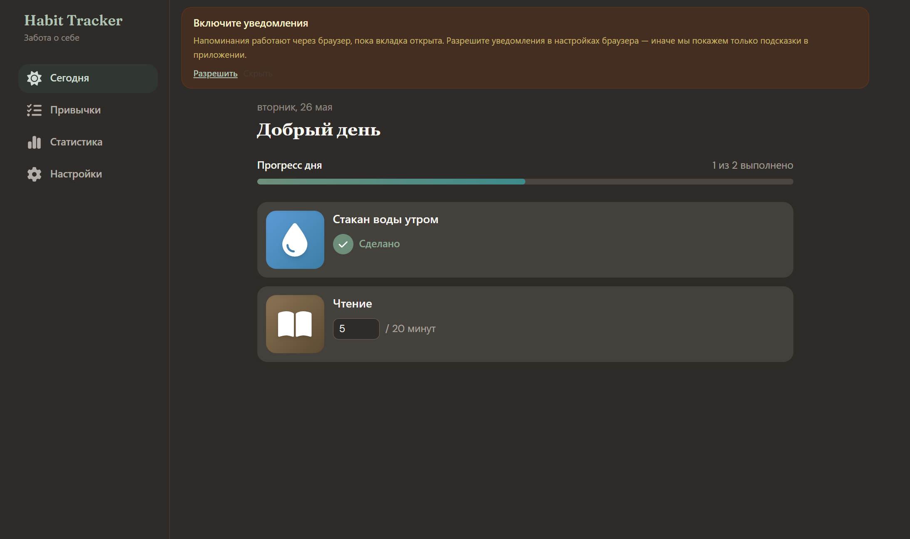
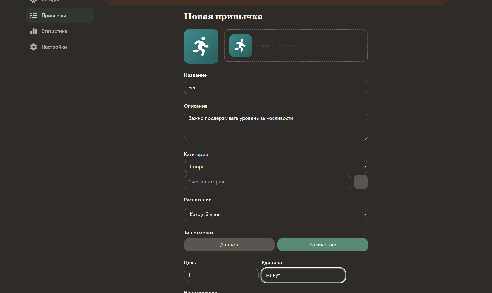
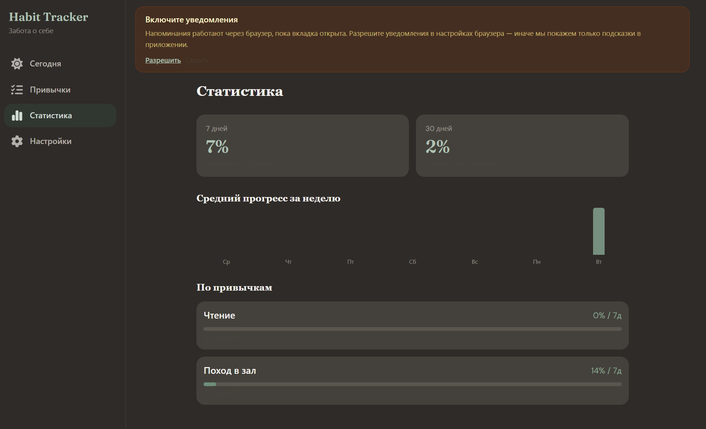

# Habit Tracker — Web

**Live demo:** [habit-trackerweb.netlify.app/habits](https://habit-trackerweb.netlify.app/habits)

SPA-трекер привычек для браузера: расписания, ежедневный чек-лист, стрики, аналитика и галерея обложек. Данные хранятся локально (IndexedDB), без backend — готов к деплою на Netlify.

## Что умеет

- **Привычки** — CRUD, категории (системные + свои), бинарная и количественная отметка
- **Расписания** — ежедневно, по дням недели, каждые N дней, по числам месяца
- **Сегодня** — чек-лист дня с прогресс-баром
- **Аналитика** — стрики, % за 7/30 дней, bar chart, heatmap за 30 дней
- **Галерея** — 24 обложки + загрузка своей (base64, до 512 КБ)
- **Данные** — экспорт JSON/CSV, импорт JSON, демо-seed при первом запуске
- **UI** — светлая / тёмная / системная тема, mobile-first

## Стек

React 18 · TypeScript · Vite · Zustand · idb (IndexedDB) · React Router · Tailwind CSS · date-fns · Vitest · PWA (Service Worker)

## Быстрый старт

```bash
npm install
npm run dev
```

```bash
npm run build    # production-сборка в dist/
npm test         # тесты расписаний и стриков
```

## Деплой на Netlify

Репозиторий уже содержит `netlify.toml` и `public/_redirects` для SPA.

1. **Add new site** → Import from Git → выбрать репозиторий
2. Build command: `npm run build`, publish: `dist`
3. Node.js: 20 или 22

Каждый push в `main` пересобирает сайт автоматически.

## Ограничения (осознанно для web MVP)

| Нет в этой версии | Почему |
|-------------------|--------|
| Backend, OAuth | Static hosting, local-first |
| Sync между устройствами | Данные в IndexedDB браузера |
| Push в фоне | Только Web Notifications при открытой вкладке |

## Roadmap

Backend API + синхронизация · OAuth · push-уведомления · шаблоны привычек · social rooms · AI-ассистент

Store и типы `AppData` рассчитаны на подключение API без переписывания UI.

## Структура

```
src/
  pages/        Today, Habits, Form, Detail, Stats, Settings
  components/   UI, gallery, charts, layout
  store/        Zustand + persistence
  lib/          schedule, streak, export (с unit-тестами)
  types/
```

## Скриншоты

**Сегодня**



**Привычки**



**Аналитика**



## Лицензия

MIT
